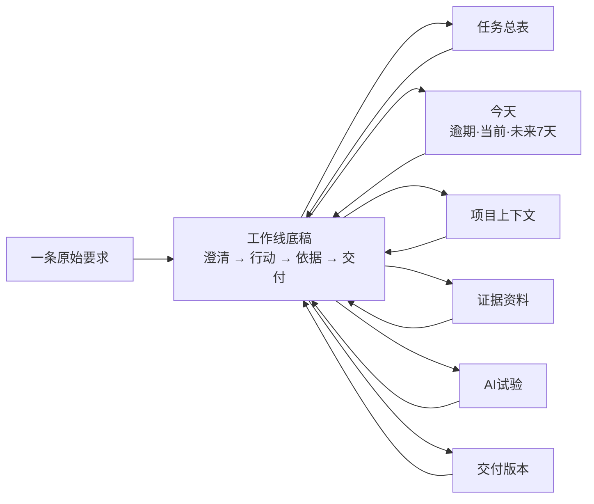
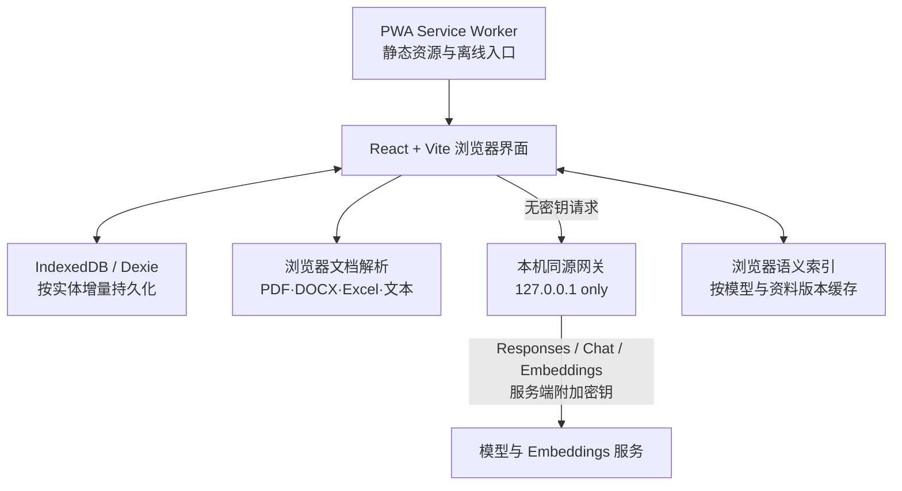

# EnableOS Web：产品与架构说明

## 1. 重新定义问题

岗位名称是“AI应用工程师实习生（Agent方向）”，但真实任务尚未确定。产品不能押注某个固定业务，也不能复制一个通用聊天框。EnableOS 的稳定对象不是“知识库”“Agent”或“自动化流程”，而是任何企业工作都需要经历的闭环：

1. 保留原始要求，避免过早改写需求。
2. 澄清使用者、目标、限制、截止时间与验收标准。
3. 收集事实、资料、决定和待确认项。
4. 提出方案，先记录基线，再做最小验证和失败分析。
5. 形成可提交成果，并让汇报能追溯到真实记录。

因此它既能支持公司业务理解、资料整理、部门访谈、平台验证、Prompt/RAG/Agent 原型，也能支持临时调研、会议跟进和普通项目工作。

## 2. 外部调研如何改变了设计

| 参考项目/资料 | 借鉴 | 明确不复制的部分 |
| --- | --- | --- |
| [Dify](https://github.com/langgenius/dify) | 工作流、RAG、模型与可观测能力应该分层 | 不在个人工作台里重做完整 Agent 编排平台 |
| [AnythingLLM](https://github.com/Mintplex-Labs/anything-llm) | 前端、服务、文档采集和模型提供方应该解耦 | 不把“聊天”作为整个产品的首页和唯一入口 |
| [Langfuse](https://github.com/langfuse/langfuse) | AI实验必须记录指标、失败和版本，而不只是展示一次好答案 | 个人版暂不建设完整追踪与数据集平台 |
| [Promptfoo](https://github.com/promptfoo/promptfoo) | 固定测试集、确定性断言、回归比较和红队思路应进入日常AI验证 | 不在工作台中复制完整CLI与供应商适配层 |
| [Actual](https://github.com/actualbudget/actual) | local-first 可以同时拥有浏览器体验和可选同步 | 当前单人版不引入同步服务器和冲突合并复杂度 |
| [Dexie](https://github.com/dexie/Dexie.js) / [IndexedDB](https://developer.mozilla.org/en-US/docs/Web/API/IndexedDB_API/Using_IndexedDB) | 浏览器数据库可以承担离线持久化，不必依赖桌面外壳 | 不用 localStorage 承载大量工作资料 |
| [MDN PWA 离线指南](https://developer.mozilla.org/en-US/docs/Web/Progressive_web_apps/Guides/Offline_and_background_operation) | Service Worker 缓存应用外壳，断网仍能进入工作区 | 不把 PWA“可安装”误写成必须安装的软件 |
| [MDN Web Crypto](https://developer.mozilla.org/en-US/docs/Web/API/SubtleCrypto/deriveKey) | 用 PBKDF2 派生密钥并以 AES-GCM 加密离线备份 | 不保存或找回用户的备份密码 |
| [OWASP CSP](https://owasp.org/www-community/controls/Content_Security_Policy) | 本机网页也应限制脚本、连接、嵌入、对象和表单来源 | 不因只监听回环地址就省略浏览器安全边界 |
| [OpenAI Skills & Plugins](https://developers.openai.com/codex/skills-and-plugins) | 技能、连接器和界面是不同扩展层，应按任务选择 | 不为了显得复杂而强行安装无关插件 |
| [OpenScience](https://github.com/synthetic-sciences/openscience) | 目标、资料、假设、实验和写作应处在一段连续工作会话里 | 不复制代码编辑器、终端或科研专用 Agent |
| [Open Canvas](https://github.com/langchain-ai/open-canvas) | 从已有内容和产物开始工作，比强迫用户先进入聊天更自然 | 不把首页改成聊天框或只支持文档写作 |
| [Anthropic frontend-design Skill](https://github.com/anthropics/claude-code/blob/main/plugins/frontend-design/skills/frontend-design/SKILL.md) | 先确定明确视觉立场，避免紫色渐变、默认字体和模板化组件 | 不为“特别”牺牲可读性、离线能力和键盘操作 |
| [design-taste-frontend Skill](https://github.com/sickn33/agentic-awesome-skills/blob/main/skills/design-taste-frontend/SKILL.md) | 主动抑制卡片泛滥、居中英雄区和脆弱响应式布局 | 不引入当前项目没有的 UI 依赖或默认组件库 |

这些参考共同完成了两次纠偏：先从“Electron 功能菜单集合”变成浏览器工作闭环，再从“常见后台仪表盘”变成一张可连续推进的工作底稿。

## 3. 产品信息架构

- “工作线”是首要对象，不是统计首页：用户先选中一件真实工作，再沿时间轴推进。
- “任务”保留原话，“项目”保存长期上下文，两者职责不同，但会在当前工作线上合流。
- 完成是可逆状态：显式确认后才完成，重新打开会清除完成时间，但不会删除历史活动。
- 截止日期进入“今天”视图参与排序和行动；删除统一进入回收站，恢复时保留原有关联。
- 项目、任务、资料、场景与交付在显式修改前保存快照，可从修改历史恢复旧版本。
- 资料、实验和交付可以直接关联具体任务；项目级上下文只作为未直接关联时的补充。
- “证据库”用于事实和来源，不等同于把所有文档无差别塞进模型。
- “AI实验”先回答值不值得做、怎么判断成功，再谈技术实现。
- “交付中心”只读取已有记录，不允许凭空编造成果。
- 设置、备份、审计和健康检查保留为工具层，不再支配产品的主视觉和主流程。

## 4. 前后端架构

### 浏览器前端负责

- 页面和交互。
- 结构化工作数据、180ms 合并保存和按实体增量持久化；旧结构打开时自动完成版本迁移。
- 通过标签页租约、BroadcastChannel 和写入锁维持单写者，多开的标签页进入只读同步状态。
- 查询浏览器持久存储状态，并允许用户主动申请长期保留。
- 文件选择、文本提取、搜索和本地规则。
- 离线缓存、主题、备份导入导出。
- 只把用户明确触发的内容交给模型网关。

### 本机网关负责

- 在生产模式下提供静态网页。
- 保存本次进程的 API 密钥，或读取环境变量。
- 校验 Origin 与 Sec-Fetch-Site、限制请求体和频率、设置超时。
- 设置 CSP、禁止跨域资源复用和 iframe 嵌入，并限制静态文件路径。
- 代理 Responses API、Chat Completions 和 Embeddings 请求，统一解析输出并返回协议与延迟诊断。
- 默认只监听 `127.0.0.1`，不对局域网和公网开放。

### 为什么不是传统云端全栈

当前是个人工作版，主要数据很可能包含公司内部资料。直接建设账号、云数据库、对象存储和向量库会扩大泄露面，也增加一个实习生无法控制的运维与权限问题。浏览器 local-first + 本机网关能先满足易打开、离线、隐私和模型能力；将来公司明确允许团队使用时，再增加认证、RBAC、审计、Postgres/向量检索和对象存储。

## 5. 数据与安全边界

- 工作数据：项目、任务、证据、实验、活动、交付和修改快照使用独立 IndexedDB 表；只写变化实体。写入前记录小型变更日志，刷新或意外关闭时可恢复。
- 数据迁移：旧的整包快照和旧 JSON 备份会在读取时补齐新字段并迁移，不直接丢弃用户数据。
- 备份：导出文件使用 PBKDF2-SHA-256（210,000 次）派生密钥和 AES-256-GCM 加密；密码不保存，导入仍兼容旧明文备份。
- API 密钥：不进入 IndexedDB、备份文件或前端日志；设置页输入的密钥只存在网关内存。
- 文件：浏览器直接读取用户选择的文件，不上传到 EnableOS 服务端。
- 外部模型：必须同时满足“用户主动触发”和“入职边界已确认为按规则允许”。默认只发送公开证据，内部证据需要额外明确选择，敏感证据在所有情况下始终排除。允许的资料还会按当前任务相关性缩小到最多 6 项，而不是顺序发送整批资料。本地模式和边界未确认状态完全不调用外部模型。
- 语义索引：先对紧凑文档卡片做粗召回，再只对候选文档片段精排；以端点、模型、资料版本和片段为键缓存在独立 IndexedDB。这样保留语义发现能力，同时避免首次提问发送整批长文档。
- 引用：证据回答会拒绝越界或缺失的 `[E#]` 引用；汇报只接收指定日期的最小证据包，并校验 `[T#]`、`[A#]`、`[P#]`、`[S#]`、`[K#]`。
- 审计：活动记录最多保留 5,000 条，可导出并重新验证带前序哈希和当前哈希的 SHA-256 校验链；它用于个人留痕，不冒充公司级不可篡改审计后台。
- 网关密钥：会话密钥绑定保存时的标准化 API 端点；页面后来修改端点时，网关拒绝复用旧密钥。诊断同时验证生成协议和向量维度。
- 外发防护：生成和向量请求在浏览器内先扫描常见私钥、API密钥、Bearer令牌、密码、身份证号和手机号；命中时阻止请求并要求脱敏。
- 文件与备份：PDF保留页码，内容 SHA-256 指纹防重复；DOCX 解压前检查中央目录与声明大小；备份限制 KDF 迭代范围和输入体积，降低资源耗尽风险。
- 数据健康：检查失效项目关联、失效工作线关联、重复标识、异常数值、颠倒日期、重复证据和关键配置缺口；只自动修复确定不会丢数据的项目。
- 高风险行为：EnableOS 不直接控制工业设备、不替代业务负责人审批，也不自动发布或发送成果。

## 6. 当前完成度与明确边界

已经完成：工作线式浏览器主产品、清晰无衬线排版、五段式工作线结构、完整任务编辑、可逆完成状态、步骤进度、任务级资料/实验/汇报关联、实体级可刷新地址与精确搜索、按实体 IndexedDB 持久化、安全文档导入与内容去重、分段 BM25 和两阶段语义检索、回答与汇报双引用校验、相关性最小外发上下文、固定用例评测、项目证据档案、PWA、加密备份恢复、入职边界核对、双协议模型网关、双模型诊断、密钥端点绑定、审计导出与验证、工作区健康检查、安全启停、桌面/手机/离线验收和无障碍审计。

当前没有假装完成：

- 当前环境没有用户的真实公司资料、公司权限结论或模型密钥，因此不能替用户伪造这些信息，也不能声称已连通某个真实供应商；设置页已把它们变成可执行核对项和一键诊断。
- 当前是用户明确要求的个人浏览器工作区，没有账号、团队同步和 RBAC；已有本地哈希链审计导出，但不是中心化审计后台。
- 语义索引为避免一次提问静默外发无限资料，单次最多索引前 400 个片段；大规模企业语料仍应在公司批准后接入专用向量库、权限过滤和离线评测集。
- AI实验已保存用例、方案版本、逐例结果、分数、通过率和决策，但还不是 Langfuse 级别的自动逐次调用追踪平台。
- Dify、FastGPT、n8n 等应作为未来连接器接入，不应内置复制其全部能力。

这些不是遗漏，而是产品边界。只有实际入职后确认公司数据权限、平台栈和协作方式，才值得把对应模块升级为团队后端。
